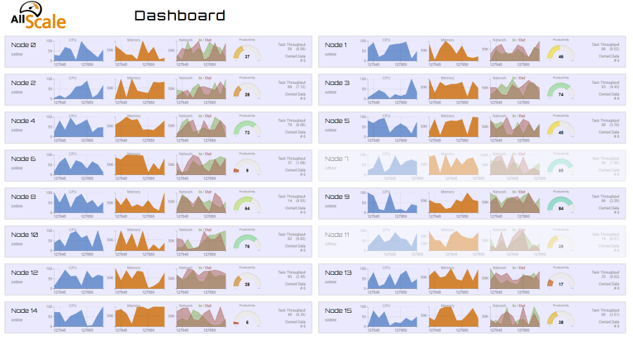

## Setup

    $ sudo apt install golang
    $ export GOPATH="$HOME/go"
    $ bash requirements.txt
    $ go run server.go
    2018/08/09 17:02:31 Starting HTTP listener on 8080
    2018/08/09 17:02:31 Starting TCP listener on 1337

Connect your browser on port `8080` and the AllScale runtime to TCP port `1337`.
Both ports are configurable.

    $ go run server.go --help
    Usage of /tmp/go-build252098734/command-line-arguments/_obj/exe/server:
      -http-port int
            port for the HTTP listener (default 8080)
      -msg-gen
            generate random messages
      -msg-gen-interval int
            message generator interval [ms] (default 1000)
      -tcp-port int
            port for the TCP listener (default 1337)

A random message generator is provided and can be activated with `-msg-gen`.

## Message Format

All messages sent between this server and the AllScale runtime are length prefixed.

Every message received from the runtime will be forwarded to *all* websocket instances -- and vice versa.

See [`send_test_message.py`](scripts/send_test_message.py) and [`receive_test_message`](scripts/receive_test_message.py) for a very basic example.

The rough specification for status updates can be found in [`runtime_state_dump_example.json`](docs/runtime_state_dump_example.json).

The random message generator can be used simultaneously.

## Performance

Having that many charts rendering in the browser can be quite performance intensive (*yeay Javascript*).
When having the dashboard open, open the browser console and use `setRefreshInterval(ms)` to adjust the update rate.
